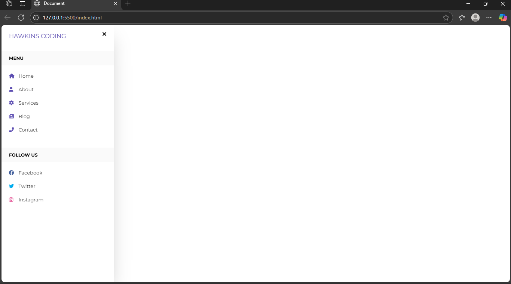

# responsive-navbar-html-css
Beginner HTML and CSS responsive sidebar navigation project as part of my learning journey
# Responsive Sidebar Navigation - Beginner Project

This is my first HTML/CSS project. It’s a responsive sidebar navigation menu built using basic CSS positioning and Font Awesome icons.

  What I Learned:
- HTML semantic structure
- Linking Google Fonts and Font Awesome icons
- CSS positioning: fixed, absolute
- Basic animations with CSS transitions
- Simple responsive layout tricks (checkbox hack)

Author:
Hawkins Muchui
